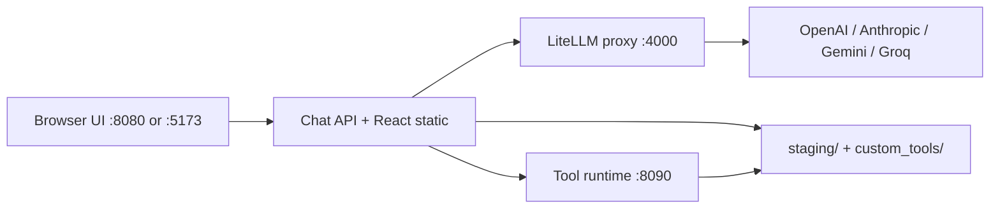

# Ada-SI

**Repository:** [github.com/nazirlouis/Ada-SI](https://github.com/nazirlouis/Ada-SI)

**Ada-SI** is a local-first, self-improving AI assistant platform. Chat with **Scout** (Ada) through a gamified interface, watch it forge new Python skills at runtime, and run interactive skill apps — all on your machine.

The UI title is **ADA Chat**. Scout is the main agent; a separate **Forge master** agent plans, writes, tests, and installs new tools when Scout needs capabilities it does not yet have.

## Table of Contents

- [Features](#features)
- [Architecture](#architecture)
- [Prerequisites](#prerequisites)
- [Installation and Setup](#installation-and-setup)
  - [Choose your install path](#choose-your-install-path)
  - [Native install (Windows)](#native-install-windows)
  - [Docker install (VPS / cross-platform)](#docker-install-vps--cross-platform)
  - [VPS deployment](#vps-deployment)
- [Configuration](#configuration)
- [Using Ada-SI](#using-ada-si)
- [Core Workflows](#core-workflows)
- [Agents](#agents)
- [Project Structure](#project-structure)
- [Developer Reference](#developer-reference)
- [Troubleshooting](#troubleshooting)
- [Tech Stack](#tech-stack)
- [License](#license)

---

## Features

- **Gamified chat UI** — XP, levels (1–50), rank titles, level-up effects, and a 3D avatar visualizer
- **Runtime skill forging** — Scout can create, test, and install Python tools on the fly with your approval
- **Interactive skill apps** — Forged skills can ship custom HTML/CSS/JS UIs (calendar, list, table, or custom layouts)
- **Multi-provider LLM routing** — OpenAI, Anthropic, Gemini, and Groq via [LiteLLM](https://github.com/BerriAI/litellm)
- **Persona and memory** — OpenClaw-style markdown files (SOUL, IDENTITY, MEMORY, and more) shape Scout's behavior
- **Voice input and TTS** — Browser speech recognition for input; optional ElevenLabs read-aloud for responses
- **Batch forging** — Create 2–10 independent tools in parallel
- **No database required** — File-based persistence plus browser `localStorage` for progression

---

## Architecture

Ada-SI runs as three cooperating services. The chat server serves the React UI and orchestrates everything; LiteLLM routes LLM calls; the tool runtime executes forged Python skills in an isolated virtual environment.



| Service | Port | Role | Key file |
|---------|------|------|----------|
| **Chat server** | 8080 | FastAPI backend, SSE chat, forge APIs, persona, TTS; serves built React UI | [`chat/app.py`](chat/app.py) |
| **LiteLLM proxy** | 4000 | Routes model requests to LLM providers | [`litellm/config.yaml`](litellm/config.yaml) |
| **Tool runtime** | 8090 | Executes installed Python skills in a sandboxed venv | [`tool_runtime/server.py`](tool_runtime/server.py) |
| **Vite dev server** (optional) | 5173 | Hot-reload frontend; proxies `/api` to chat server | [`chat/frontend/vite.config.ts`](chat/frontend/vite.config.ts) |

**Frontend** — React 19 + TypeScript + Vite, source in [`chat/frontend/`](chat/frontend), production build output in [`chat/static/`](chat/static).

**Persistence** — No traditional database. Runtime config lives in `chat/staging/`; forged skills in `chat/custom_tools/`; player XP in browser `localStorage`.

---

## Prerequisites

**Native install (Windows)**

| Requirement | Version | Used for |
|-------------|---------|----------|
| **Python** | 3.12 | Chat server, tool runtime, LiteLLM venv |
| **Node.js** | 22+ | Frontend build and dev mode |
| **PowerShell** | 5.1+ | Native launchers ([`start.ps1`](start.ps1), [`install-native.ps1`](install-native.ps1)) |

On Windows, the launcher looks for Python via `py -3.12`, `python3.12`, or `python`.

**Docker install (VPS / cross-platform)**

| Requirement | Version | Used for |
|-------------|---------|----------|
| **Docker Engine** | — | Container runtime |
| **Docker Compose** | v2 plugin | Orchestrates three services via [`docker-compose.yml`](docker-compose.yml) |

No host Python or Node.js is required for Docker — the frontend is built inside the [`chat/Dockerfile`](chat/Dockerfile) image.

---

## Installation and Setup

### Choose your install path

| Goal | Install path | Scripts |
|------|--------------|---------|
| **Local Windows development** | Native | [`install-native.bat`](install-native.bat) → [`start.bat`](start.bat) |
| **VPS, Linux, Mac, or Windows with Docker Desktop** | Docker | [`install-docker.sh`](install-docker.sh) / [`install-docker.bat`](install-docker.bat) → [`start-docker.sh`](start-docker.sh) / [`start-docker.bat`](start-docker.bat) |

Both paths use the same [`.env`](.env.example) configuration and persist data under `chat/staging/` and `chat/custom_tools/`.

---

### Native install (Windows)

1. **Clone the repository**

   ```powershell
   git clone https://github.com/nazirlouis/Ada-SI.git
   cd Ada-SI
   ```

2. **Run the native installer** (first time only)

   ```powershell
   .\install-native.bat
   ```

   This creates `.env` from [`.env.example`](.env.example), prepares runtime directories, and installs Python/Node dependencies.

3. **Edit `.env`** — set at minimum:

   ```env
   LITELLM_MASTER_KEY=sk-ada-dev-key
   LITE_MODEL=openai/gpt-4o-mini
   TOOL_CREATOR_MODEL=openai/gpt-4o-mini
   OPENAI_API_KEY=sk-...
   ```

   Use any secure string for `LITELLM_MASTER_KEY`. Model IDs follow the `provider/model` format (e.g. `anthropic/claude-sonnet-4-20250514`, `gemini/gemini-2.0-flash`, `groq/llama-3.3-70b-versatile`). Add keys only for providers you plan to use.

4. **Start Ada-SI**

   ```powershell
   .\start.bat
   ```

   Or run the PowerShell script directly:

   ```powershell
   .\start.ps1
   ```

5. **Open the app** — your browser should open automatically at:

   ```
   http://127.0.0.1:8080
   ```

### What `start.ps1` Does

The launcher handles the full native setup:

- Creates Python virtual environments: `.venv` (app) and `.venv-litellm` (LiteLLM proxy)
- Installs Python dependencies from [`chat/requirements.txt`](chat/requirements.txt) and [`tool_runtime/requirements.txt`](tool_runtime/requirements.txt)
- Runs `npm ci` and `npm run build` in `chat/frontend` (unless `-SkipBuild` is passed)
- Starts LiteLLM on port **4000**, tool runtime on **8090**, and the chat server on **8080**
- Writes service logs to [`logs/`](logs/) (`chat.log`, `litellm.log`, `tool-runtime.log`)
- Tracks process IDs in `.ada-si.pids`

### `start.ps1` Flags

| Flag | Effect |
|------|--------|
| `-Dev` | Run Vite dev server at `http://127.0.0.1:5173` (proxies `/api` → `:8080`) |
| `-SkipBuild` | Skip `npm run build` when static assets already exist |
| `-NoBrowser` | Do not auto-open a browser tab |
| `-InstallOnly` | Install dependencies and exit without starting services |

**Examples:**

```powershell
.\start.ps1 -Dev          # Frontend hot-reload during development
.\start.ps1 -InstallOnly  # Set up venvs and deps only
.\start.ps1 -NoBrowser    # Start services without opening a tab
```

### Stopping native services

```powershell
.\stop.ps1
```

Or press **Ctrl+C** in the terminal where `start.ps1` is running.

---

### Docker install (VPS / cross-platform)

Use Docker when deploying to a VPS or when you do not want to install Python and Node on the host. The frontend is built automatically inside the Docker image — no manual `npm run build` required.

**Linux / macOS**

1. **Clone and install**

   ```bash
   git clone https://github.com/nazirlouis/Ada-SI.git
   cd Ada-SI
   chmod +x install-docker.sh start-docker.sh stop-docker.sh
   ./install-docker.sh
   ```

2. **Edit `.env`** — add your API keys (same variables as native install).

3. **Start Ada-SI**

   ```bash
   ./start-docker.sh
   ```

4. **Open the app** at `http://localhost:8080` (or `http://<your-server-ip>:8080` on a VPS).

**Windows (Docker Desktop)**

```powershell
git clone https://github.com/nazirlouis/Ada-SI.git
cd Ada-SI
.\install-docker.bat
# edit .env
.\start-docker.bat
```

**Docker commands**

| Action | Linux / macOS | Windows |
|--------|---------------|---------|
| Install | `./install-docker.sh` | `.\install-docker.bat` |
| Start | `./start-docker.sh` | `.\start-docker.bat` |
| Stop | `./stop-docker.sh` | `.\stop-docker.bat` |
| View logs | `docker compose logs -f` | `docker compose logs -f` |
| Update / rebuild | Re-run `start-docker` | Re-run `start-docker` |

**What Docker runs**

- Three containers: LiteLLM, tool runtime, and chat server
- Only **port 8080** is exposed to the host; LiteLLM and tool runtime are internal
- Data persists via volume mounts: `chat/staging/`, `chat/custom_tools/`
- See [`docker-compose.yml`](docker-compose.yml) for service wiring

---

### VPS deployment

When running Ada-SI on a remote server, use the **Docker install** path above.

1. **Firewall** — open port 8080, or place a reverse proxy (Caddy, nginx) in front for HTTPS on port 443.

   ```bash
   sudo ufw allow 8080/tcp
   ```

2. **Security** — Ada-SI has **no built-in authentication**. Do not expose port 8080 to the public internet without a reverse proxy, VPN, or IP allowlist.

3. **Auto-start on reboot** (optional systemd unit):

   ```ini
   # /etc/systemd/system/ada-si.service
   [Unit]
   Description=Ada-SI
   After=docker.service
   Requires=docker.service

   [Service]
   Type=oneshot
   RemainAfterExit=yes
   WorkingDirectory=/opt/Ada-SI
   ExecStart=/usr/bin/docker compose up -d
   ExecStop=/usr/bin/docker compose down

   [Install]
   WantedBy=multi-user.target
   ```

   Then: `sudo systemctl enable --now ada-si`

4. **Back up** `chat/staging/`, `chat/custom_tools/`, and `.env` — these hold persona, secrets, and forged skills.

---

## Configuration

### Environment Variables

Copy [`.env.example`](.env.example) to `.env` and configure:

| Variable | Required | Description |
|----------|----------|-------------|
| `LITELLM_MASTER_KEY` | Yes | Auth key for the LiteLLM proxy (any secure string) |
| `LITE_MODEL` | Yes* | Scout chat model (`provider/model`, e.g. `openai/gpt-4o-mini`) |
| `TOOL_CREATOR_MODEL` | Yes* | Forge/codegen model |
| `LITE_MODEL_REASONING_EFFORT` | No | Scout reasoning: `low`, `medium`, or `high` (empty to disable) |
| `CHAT_MODEL` | No | Legacy fallback if `LITE_MODEL` is unset |
| `SECOND_MODEL` | No | Legacy fallback if `TOOL_CREATOR_MODEL` is unset |
| `OPENAI_API_KEY` | No** | OpenAI API key |
| `ANTHROPIC_API_KEY` | No** | Anthropic API key |
| `GEMINI_API_KEY` | No** | Google Gemini API key |
| `GROQ_API_KEY` | No** | Groq API key |
| `ELEVENLABS_API_KEY` | No | ElevenLabs TTS for read-aloud voice output |
| `ADA_LOG_LEVEL` | No | Debug logging level (e.g. `DEBUG` — see `logs/chat.log`) |
| `ADA_LOG_MAX_BODY` | No | Max logged response body size (default `32000`) |

\* At least one of `LITE_MODEL` / `CHAT_MODEL` and `TOOL_CREATOR_MODEL` / `SECOND_MODEL` should be set.

\** At least one provider key is required for models to appear in the picker.

**Set automatically by `start.ps1`** (override in `.env` if needed):

| Variable | Default |
|----------|---------|
| `LITELLM_URL` | `http://127.0.0.1:4000` |
| `TOOL_RUNTIME_URL` | `http://127.0.0.1:8090` |
| `TOOLS_DIR` | `chat/custom_tools` |
| `VENV_PATH` | `chat/.tool_runtime_venv` |

### Settings UI

Click the **gear icon** in the header to open Settings. All sections are available without restarting the app (model changes take effect on the next chat).

| Section | What you configure |
|---------|-------------------|
| **Agents** | Scout model, Forge model, reasoning effort, Gemini Google Search toggle |
| **API keys** | Provider keys (saved to `chat/staging/secrets.json`) |
| **Voice** | ElevenLabs TTS on/off and voice selection |
| **Persona** | Markdown persona files, bootstrap ritual, heartbeat interval |
| **Model prompts** | Scout routing and Forge phase prompt templates |
| **Progress** | View XP stats; reset level, skills, and pip packages |

API keys can be set in **three places** (in order of precedence at runtime): Settings UI → `chat/staging/secrets.json` → `.env`.

### Runtime Data Locations

These directories are gitignored and created at runtime:

| Path | Contents |
|------|----------|
| `chat/staging/secrets.json` | API keys managed via Settings |
| `chat/staging/persona/` | Live persona markdown files |
| `chat/staging/prompts_config.json` | Custom prompt overrides |
| `chat/staging/persona_config.json` | Heartbeat on/off and interval |
| `chat/custom_tools/` | Forged Python skills and their data |
| `logs/` | Service log files |

Persona templates (committed defaults) live in [`chat/persona_defaults/`](chat/persona_defaults/).

---

## Using Ada-SI

Ada-SI is a **single-screen application** — there is no page routing. The main layout is defined in [`chat/frontend/src/components/layout/AppShell.tsx`](chat/frontend/src/components/layout/AppShell.tsx).

### UI Layout

```
┌─────────────────────────────────────────────────────────────────┐
│  Header: Level / XP / Rank / Model picker / Settings / New quest │
├──────────────┬──────────────────────────────┬───────────────────┤
│  Quest Log   │         Chat area            │  Skill Loadout    │
│  (left)      │  Messages + Composer         │  (right sidebar)  │
│              │                              │  Skills | Supplies│
│  Live steps  │  Tool plans, forge viewers   │                   │
│  Abort btn   │  Mic input, read-aloud       │  Installed skills │
├──────────────┴──────────────────────────────┴───────────────────┤
│  3D avatar visualizer (activity feedback)                        │
└─────────────────────────────────────────────────────────────────┘
```

| Area | Component | How to use |
|------|-----------|------------|
| **Quest Log** (left) | `ProcessPanel` | Shows live agent steps during chat and forging. Click **Abort** to cancel an in-flight run. |
| **Chat** (center) | `Messages` + `Composer` | Type messages or use the microphone. Tool plan cards appear inline for approval. |
| **Header stats** | `PlayerStatsBar` | Displays level, XP bar, rank title, and installed skill count. |
| **Skill Loadout** (right) | `SidePanel` | **Skills** tab lists installed tools; **Supplies** tab lists pip packages in the tool-runtime venv. |
| **3D avatar** | `AiVisualizerAvatar` | Animated visualizer that reacts to agent activity. |
| **Settings** | `SettingsModal` | Configure agents, keys, voice, persona, prompts, and progress. |
| **Skill apps** | `SkillAppShell` | Full-screen overlay when opening an interactive skill. |
| **Forge batch** | `ForgeBatchModal` | Multi-tool forge workflow when Scout proposes a batch. |

### Modals and Overlays

- **Settings** — Six configuration sections (see [Configuration](#configuration))
- **Skill apps** — Interactive UIs for forged skills (calendar, list, table, or custom iframe templates)
- **Forge batch** — Parallel plan review and build for 2–10 tools
- **Celebrations** — Level-up confetti, skill-unlock modals, and sound effects

---

## Core Workflows

### A. First-Time Setup

1. Run `.\install-native.bat` (first time) or `.\start.bat` / `.\start.ps1`
2. Open **Settings → API keys** and add at least one LLM provider key (or set keys in `.env` before starting)
3. Open **Settings → Agents** and select models for **Scout** and **Forge master**
4. Optional: **Settings → Persona → Start bootstrap ritual** to run the "Give Scout a soul" identity setup guided by Scout

There is **no login or authentication**. Ada-SI is designed to run locally on your machine.

### B. Chatting with Scout

1. Type a message in the composer or click the **microphone** for voice input (browser Web Speech API)
2. Scout streams its reply. Reasoning/thinking blocks appear for supported models
3. Scout may call installed skills automatically, or propose forging a new one
4. The **Quest Log** on the left shows step-by-step progress; use **Abort** to cancel
5. Optional: enable **read-aloud** in Settings → Voice (requires ElevenLabs API key)
6. Gemini models with Google Search enabled can surface web search sources in replies

**New quest** (header button) clears the chat and starts a fresh conversation.

### C. Forging a Single Skill

When Scout needs a capability it does not have, it proposes a tool plan:

1. **Ask** Scout for something it cannot do yet (e.g. "Track my daily water intake")
2. A **tool plan card** appears in chat — review the proposed skill name, description, and approach
3. Choose **Approve**, **Revise** (provide feedback), or **Reject**
4. On approval, the **Forge build pipeline** runs. Watch progress in the Quest Log:

   | Step | Label |
   |------|-------|
   | `generate_code` | Blueprint skill code |
   | `validate_code` | Inspect module structure |
   | `sandbox_test` | Trial in test venv |
   | `validate_ui` | Validate app UI |
   | `contract_test` | Test skill API contract |
   | `preview_review` | Automated app review |
   | `ui_preview` | Preview interactive app |
   | `pip_review` | Review supply packages |
   | `runtime_verify` | Verify skill runtime |
   | `install_tool` | Unlock skill |

5. **Human-in-the-loop gates** may pause the build:
   - **Pip approval** — when the skill needs new Python packages (reviewed in Supplies)
   - **UI preview approval** — when the skill has an interactive app (approve or request revisions)
6. On success, the skill appears in **Skill Loadout** and you earn XP (+180 for skill unlock)

### D. Batch Forging

Scout can propose **2–10 independent tools** at once via `propose_tool_batch`:

1. Scout presents a batch of tool plans
2. The **Forge Batch Modal** opens for parallel review
3. Approve, revise, or reject individual plans (or approve all)
4. Start the batch build — tools are forged in parallel where possible
5. Scout resumes automatically when the batch completes

### E. Using Installed Skills

**Headless skills** — Scout calls them during chat without any action from you. Examples: calculators, API wrappers, file processors.

**Interactive skills** — Skills with custom UIs open in the **Skill App** overlay:

- Open from the **Skills** tab in the right sidebar, or ask Scout to open one
- UI templates: `calendar`, `list`, `table`, or `custom` (iframe)
- Skill actions run via `POST /api/skills/{name}/action`
- Persistent data is stored under `chat/custom_tools/{skill_name}/skill_data/`

**Removing skills** — Delete from the Skills tab, or use Settings → Progress → reset.

### F. Persona and Memory

Scout's personality and long-term memory are stored as markdown files, inspired by the OpenClaw persona system.

| File | Purpose |
|------|---------|
| `AGENTS.md` | Operating rules and forge routing reminders |
| `SOUL.md` | Core personality and values |
| `IDENTITY.md` | Name, role, and presentation |
| `USER.md` | Information about you |
| `MEMORY.md` | Durable facts Scout should remember |
| `HEARTBEAT.md` | Rules for background memory maintenance |
| `TOOLS.md` | Notes about installed skills |
| `BOOTSTRAP.md` | Guided first-time identity ritual |

- **Defaults** (committed): [`chat/persona_defaults/`](chat/persona_defaults/)
- **Runtime copies** (gitignored): `chat/staging/persona/`
- Edit files in **Settings → Persona**, or let Scout update them via memory tools during chat
- **Bootstrap ritual** — first-time guided setup via Settings → Persona → Start bootstrap ritual
- **Heartbeat** — background service (~30 min interval, configurable) consolidates daily logs into MEMORY. Toggle in Persona settings.

### G. Gamification

| Mechanic | Detail |
|----------|--------|
| **XP sources** | +30 for chat completion, +180 for skill unlock |
| **Levels** | 1–50 (max total XP capped at level 50) |
| **Rank titles** | Initiate (1) → Operator (11) → Architect (21) → Synthesist (31) → Apex (41) |
| **Storage** | Browser `localStorage` key `ada-player-progress` |
| **Reset** | Settings → Progress → reset all progress, skills, and supplies |

Level-up triggers confetti and sound effects via the effects layer.

---

## Agents

Ada-SI uses two LLM-backed agents with separate model assignments:

| Agent | Role | Model variable | Prompt config |
|-------|------|----------------|---------------|
| **Scout** (Ada) | Main chat, tool routing, skill execution, memory updates | `LITE_MODEL` | Scout routing prompts |
| **Forge master** | Tool planning, code generation, validation, UI design | `TOOL_CREATOR_MODEL` | Forge phase prompts |

Default prompts live in [`chat/prompts_config.py`](chat/prompts_config.py). Customize them in **Settings → Model prompts** (saved to `chat/staging/prompts_config.json`).

**Forge guidance** — additional context injected during forging. Edit in Settings or via `GET/PUT /api/forger-guidance` ([`chat/forger_guidance.py`](chat/forger_guidance.py)).

---

## Project Structure

```
Ada-SI/
├── install-native.bat        # Native Windows first-time install
├── install-native.ps1
├── install-docker.sh         # Docker first-time install (Unix)
├── install-docker.bat        # Docker first-time install (Windows)
├── install-docker.ps1
├── start.bat                 # Native Windows launcher (calls start.ps1)
├── start.ps1                 # Native setup + service orchestration
├── start-docker.sh           # Start Docker stack (Unix)
├── start-docker.bat          # Start Docker stack (Windows)
├── start-docker.ps1
├── stop.ps1                  # Stop native services
├── stop-docker.sh            # Stop Docker stack (Unix)
├── stop-docker.bat           # Stop Docker stack (Windows)
├── stop-docker.ps1
├── .env.example              # Environment variable template
├── docker-compose.yml        # Docker deployment (3 services)
├── LICENSE                   # MIT license
│
├── litellm/
│   └── config.yaml           # LiteLLM model routing config
│
├── tool_runtime/             # Isolated Python skill execution service
│   ├── server.py             # FastAPI: /health, /tools, /run, pip install
│   ├── runner.py             # Tool install and execution logic
│   ├── Dockerfile
│   └── requirements.txt
│
├── chat/                     # Main application (port 8080)
│   ├── app.py                # FastAPI monolith: chat, forge, persona, TTS APIs
│   ├── tools_engine.py       # Skill loading, execution, manifests
│   ├── tool_creator.py       # Forge LLM code generation
│   ├── build_pipeline.py     # Build phases and approval gates
│   ├── forge_batch.py        # Multi-tool batch orchestration
│   ├── scout_persona.py      # Persona file management
│   ├── heartbeat_service.py  # Background memory maintenance
│   ├── litellm_client.py     # LLM streaming client
│   ├── runtime_client.py     # Tool runtime HTTP client
│   ├── prompts_config.py     # Scout/Forge prompt defaults
│   ├── secrets_config.py     # API key storage
│   ├── elevenlabs_tts.py     # Text-to-speech integration
│   ├── forger_guidance.py    # Forge runtime context
│   ├── test_*.py             # Python unit tests
│   │
│   ├── persona_defaults/     # Committed persona templates
│   ├── staging/              # Runtime config (gitignored)
│   ├── custom_tools/         # Forged skills at runtime (gitignored)
│   ├── static/               # Built frontend (served at / and /static)
│   └── frontend/             # React + TypeScript + Vite source
│       ├── package.json
│       ├── vite.config.ts
│       └── src/
│           ├── api/          # REST + SSE clients
│           ├── components/   # chat, tools, settings, visualizer, effects
│           ├── hooks/        # useChatStream, useToolBuildStream, TTS, etc.
│           └── state/        # Zustand store + progression
│
└── logs/                     # Runtime service logs (gitignored)
```

---

## Developer Reference

Source: [https://github.com/nazirlouis/Ada-SI](https://github.com/nazirlouis/Ada-SI)

### Frontend Development

```powershell
# Option 1: Launcher with hot-reload
.\start.ps1 -Dev

# Option 2: Manual Vite dev server (chat API must be running on :8080)
cd chat/frontend
npm run dev
```

Vite dev server runs at `http://127.0.0.1:5173` and proxies `/api` requests to the chat server.

**Production build:**

```bash
cd chat/frontend
npm ci
npm run build    # Output → chat/static/
```

Other npm scripts: `npm run lint` (ESLint), `npm run preview` (preview production build).

### Key Backend Modules

| Module | Responsibility |
|--------|----------------|
| [`chat/app.py`](chat/app.py) | FastAPI routes, SSE chat loop, forge approval endpoints |
| [`chat/tools_engine.py`](chat/tools_engine.py) | Skill discovery, execution, UI serving, data persistence |
| [`chat/build_pipeline.py`](chat/build_pipeline.py) | Multi-phase forge build with approval gates |
| [`chat/tool_creator.py`](chat/tool_creator.py) | LLM-driven code generation for new skills |
| [`chat/forge_batch.py`](chat/forge_batch.py) | Parallel multi-tool forge orchestration |
| [`chat/scout_persona.py`](chat/scout_persona.py) | Persona file read/write, bootstrap, reset |
| [`chat/heartbeat_service.py`](chat/heartbeat_service.py) | Periodic memory consolidation |
| [`chat/litellm_client.py`](chat/litellm_client.py) | Streaming LLM calls via LiteLLM proxy |
| [`chat/runtime_client.py`](chat/runtime_client.py) | HTTP client for tool runtime service |

### API Endpoints

All routes are defined in [`chat/app.py`](chat/app.py). Grouped by area:

**Chat and runs**

| Endpoint | Method | Purpose |
|----------|--------|---------|
| `/api/config` | GET | App config, tools list, runtime health |
| `/api/models` | GET | Available LLM models |
| `/api/chat` | POST | Main chat stream (SSE) |
| `/api/resume_scout` | POST | Resume Scout after skill install |
| `/api/cancel_run` | POST | Cancel in-flight run |

**Forge (single tool)**

| Endpoint | Method | Purpose |
|----------|--------|---------|
| `/api/approve_tool` | POST | Approve plan → start build (SSE) |
| `/api/revise_tool` | POST | Revise rejected plan (SSE) |
| `/api/reject_tool` | POST | Reject plan |
| `/api/approve_pip` | POST | Approve pip install (SSE) |
| `/api/reject_pip` | POST | Reject pip install |
| `/api/approve_preview` | POST | Approve UI preview (SSE) |
| `/api/revise_preview` | POST | Request UI changes (SSE) |
| `/api/reject_preview` | POST | Reject UI preview |

**Forge (batch)**

| Endpoint | Method | Purpose |
|----------|--------|---------|
| `/api/forge_batch/confirm` | POST | Confirm batch → parallel planning (SSE) |
| `/api/forge_batch/cancel` | POST | Cancel batch |
| `/api/forge_batch/approve_plan` | POST | Approve one plan |
| `/api/forge_batch/approve_all_plans` | POST | Approve all plans |
| `/api/forge_batch/reject_plan` | POST | Reject a plan |
| `/api/forge_batch/revise_plan` | POST | Revise a plan (SSE) |
| `/api/forge_batch/start_build` | POST | Build approved tools (SSE) |
| `/api/forge_batch/resume_agent` | POST | Resume Scout after batch |

**Skills and supplies**

| Endpoint | Method | Purpose |
|----------|--------|---------|
| `/api/tools` | GET | List installed skills |
| `/api/tools/{name}` | DELETE | Remove a skill |
| `/api/skills/{name}/ui` | GET | Skill UI entry HTML |
| `/api/skills/{name}/ui/{path}` | GET | Skill UI static assets |
| `/api/skills/{name}/action` | POST | Run skill action from UI |
| `/api/skills/{name}/data` | GET/PUT | Skill persistent JSON data |
| `/api/pip/packages` | GET | Installed pip packages |
| `/api/pip/packages/{name}` | DELETE | Uninstall package |

**Persona, secrets, prompts, TTS**

| Endpoint | Method | Purpose |
|----------|--------|---------|
| `/api/persona` | GET/PUT | Read/write persona files |
| `/api/persona/status` | GET | Bootstrap status |
| `/api/persona/reset` | POST | Reset to defaults |
| `/api/persona/bootstrap` | POST | Start bootstrap ritual |
| `/api/persona/config` | PUT | Heartbeat settings |
| `/api/prompts` | GET/PUT | Model prompt templates |
| `/api/prompts/reset` | POST | Reset prompts to defaults |
| `/api/secrets` | GET/PUT | API key status and storage |
| `/api/secrets/{key}` | DELETE | Clear one key |
| `/api/forger-guidance` | GET/PUT | Forge context text |
| `/api/forger-guidance/reset` | POST | Reset forger guidance |
| `/api/tts` | POST | Text-to-speech |
| `/api/tts/stream` | POST | Streaming TTS |
| `/api/tts/voices` | GET | List TTS voices |

**Tool runtime** (internal, port 8090) — see [`tool_runtime/server.py`](tool_runtime/server.py): `/health`, `/tools`, `/tools/{name}/run`, `/tools/{name}/install`, `/pip/install`.

Frontend API client: [`chat/frontend/src/api/client.ts`](chat/frontend/src/api/client.ts).

### Tests

Python tests in `chat/test_*.py`:

```bash
# From repo root with .venv activated
python -m pytest chat/
```

Or run individual test files:

```bash
python chat/test_litellm_client.py
python chat/test_tool_verify.py
python chat/test_elevenlabs_tts.py
```

### Logs

| File | Service |
|------|---------|
| `logs/chat.log` | Chat server |
| `logs/litellm.log` | LiteLLM proxy |
| `logs/tool-runtime.log` | Tool runtime |

Set `ADA_LOG_LEVEL=DEBUG` in `.env` for verbose stream logging.

### Optional Environment Overrides

| Variable | Purpose |
|----------|---------|
| `ADA_PERSONA_DIR` | Alternate persona directory ([`scout_persona.py`](chat/scout_persona.py)) |

---

## Troubleshooting

| Problem | Solution |
|---------|----------|
| **No models in the picker** | Add a provider API key in Settings → API keys or `.env`. Only providers with valid keys return models. |
| **Services won't start (native)** | Verify Python 3.12 and Node.js 22+ are installed. Check `logs/` for errors. Try `.\install-native.bat` or `.\start.ps1 -InstallOnly` then `.\start.ps1`. |
| **Services won't start (Docker)** | Ensure Docker is running. Check `docker compose logs` for errors. Verify `.env` exists and API keys are set. Try `.\stop-docker.ps1` then re-run `start-docker`. |
| **Blank or broken UI** | Run `npm run build` in `chat/frontend`, or start with `.\start.ps1 -Dev`. Ensure `chat/static/index.html` exists. |
| **LiteLLM connection errors** | Confirm LiteLLM is running on port 4000. Check `logs/litellm.log`. Verify `LITELLM_MASTER_KEY` matches in `.env` and LiteLLM config. |
| **Forge fails at pip step** | Review the proposed packages in the Supplies tab. Approve or reject; some packages may conflict. |
| **Forge fails at UI preview** | Request revisions with specific feedback, or reject and ask Scout to simplify the skill. |
| **TTS not working** | Set `ELEVENLABS_API_KEY` in Settings or `.env`. Enable TTS in Settings → Voice. |
| **Scout seems forgetful** | Check `MEMORY.md` in Settings → Persona. Run bootstrap if persona files are empty. Ensure heartbeat is enabled. |
| **Reset everything** | Settings → Progress → reset. Or delete `chat/staging/` and `chat/custom_tools/` (back up first). Clear browser `localStorage` for XP reset. |
| **Port already in use (native)** | Stop other instances with `.\stop.ps1`. Check `.ada-si.pids` for stale processes. |
| **Port already in use (Docker)** | Run `.\stop-docker.ps1` or `docker compose down`. Ensure no native `start.ps1` instance is also bound to port 8080. |

---

## Tech Stack

| Layer | Technologies |
|-------|--------------|
| **Backend** | Python 3.12, FastAPI, Uvicorn, httpx |
| **LLM routing** | LiteLLM proxy |
| **Tool sandbox** | Separate FastAPI service + Python venv |
| **Frontend** | React 19, TypeScript, Vite 8 |
| **UI / graphics** | Framer Motion, Three.js, @react-three/fiber, Zustand |
| **Markdown** | react-markdown, highlight.js, rehype-sanitize |
| **Audio** | Howler.js, ElevenLabs TTS, Web Speech API |
| **Containers** | Docker Compose |

**LLM providers** (via LiteLLM): OpenAI, Anthropic, Google Gemini, Groq.

---

## License

Ada-SI is released under the [MIT License](LICENSE).

Copyright (c) 2026 Ada-SI contributors. Source: [github.com/nazirlouis/Ada-SI](https://github.com/nazirlouis/Ada-SI).

### Third-Party / Open-Source Dependencies

Ada-SI builds on many open-source libraries. Major dependencies and their licenses:

**Backend (Python)**

| Package | License |
|---------|---------|
| [FastAPI](https://github.com/tiangolo/fastapi) | MIT |
| [Uvicorn](https://github.com/encode/uvicorn) | BSD-3-Clause |
| [httpx](https://github.com/encode/httpx) | BSD-3-Clause |
| [LiteLLM](https://github.com/BerriAI/litellm) | MIT |

**Frontend (JavaScript / TypeScript)**

| Package | License |
|---------|---------|
| [React](https://github.com/facebook/react) | MIT |
| [Vite](https://github.com/vitejs/vite) | MIT |
| [Three.js](https://github.com/mrdoob/three.js) | MIT |
| [Zustand](https://github.com/pmndrs/zustand) | MIT |
| [Framer Motion](https://github.com/motiondivision/motion) | MIT |
| [Howler.js](https://github.com/goldfire/howler.js) | MIT |
| [react-markdown](https://github.com/remarkjs/react-markdown) | MIT |
| [@react-three/fiber](https://github.com/pmndrs/react-three-fiber) | MIT |
| [highlight.js](https://github.com/highlightjs/highlight.js) | BSD-3-Clause |

**Infrastructure**

| Component | License |
|-----------|---------|
| [LiteLLM Docker image](https://github.com/BerriAI/litellm) (BerriAI) | MIT |

See [`chat/frontend/package.json`](chat/frontend/package.json), [`chat/requirements.txt`](chat/requirements.txt), and [`tool_runtime/requirements.txt`](tool_runtime/requirements.txt) for complete dependency lists.
